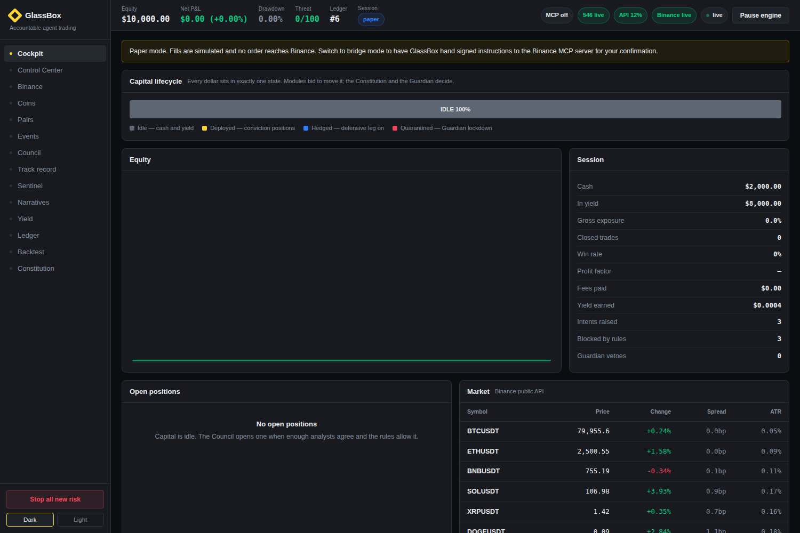
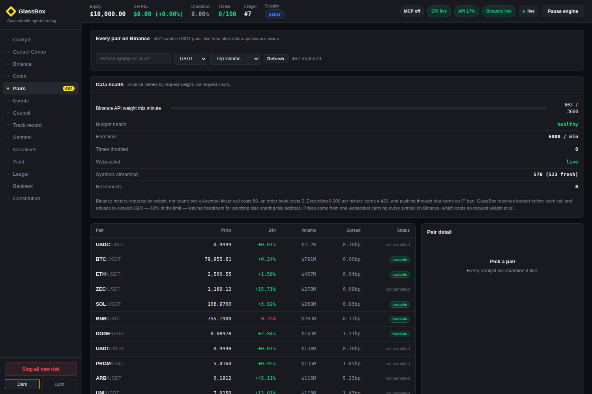
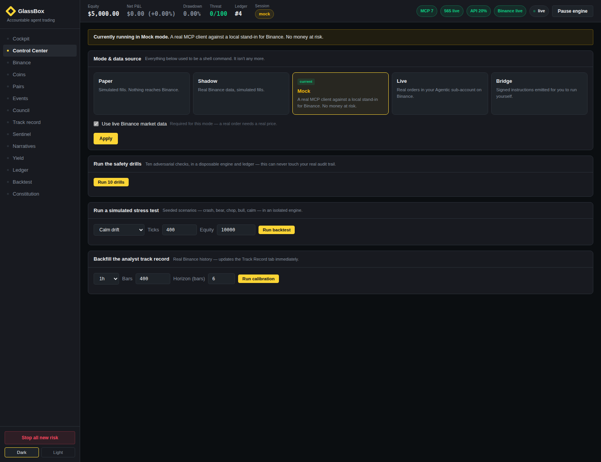
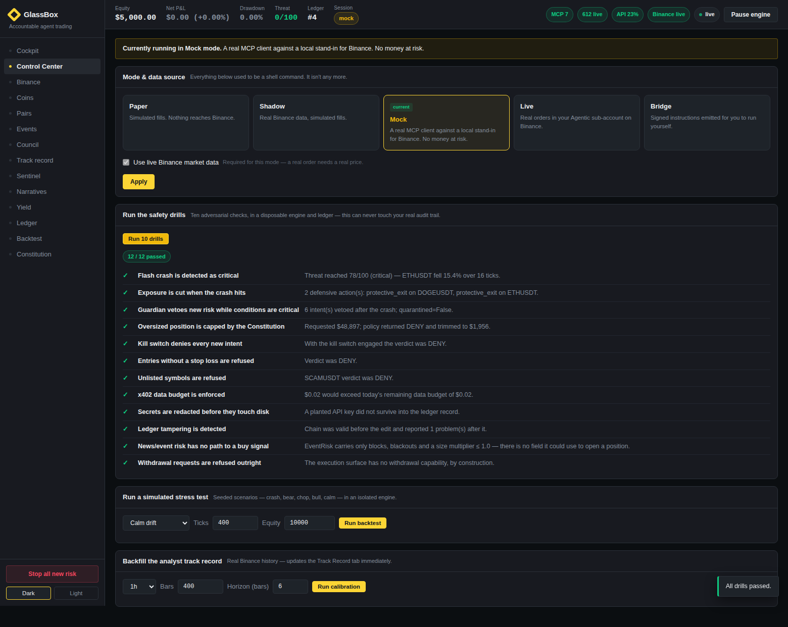
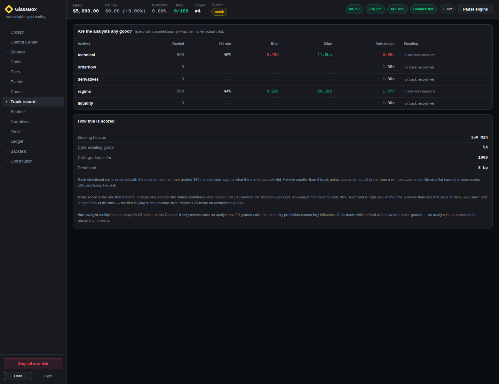
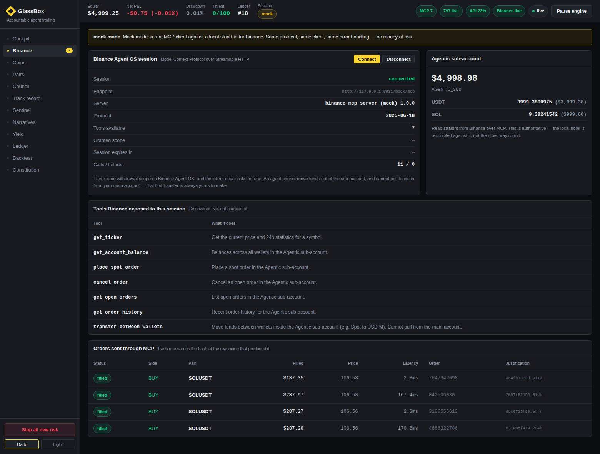
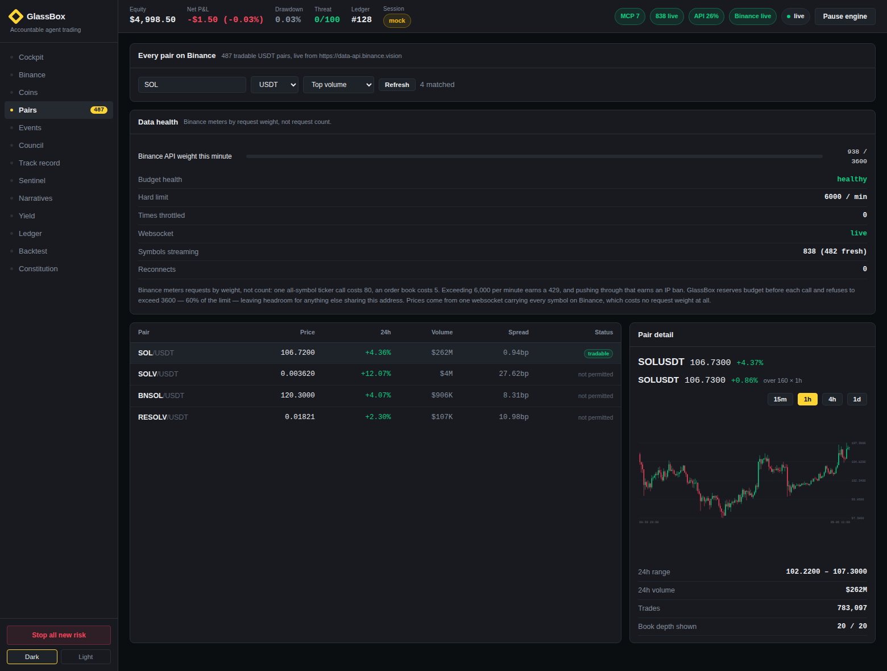
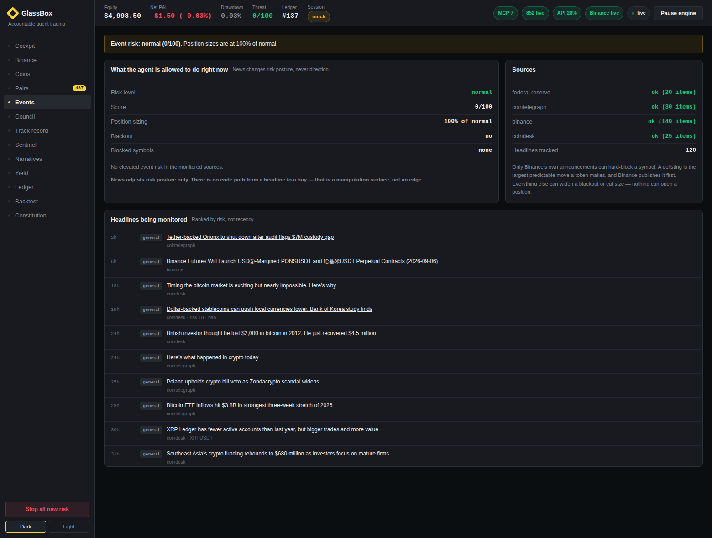
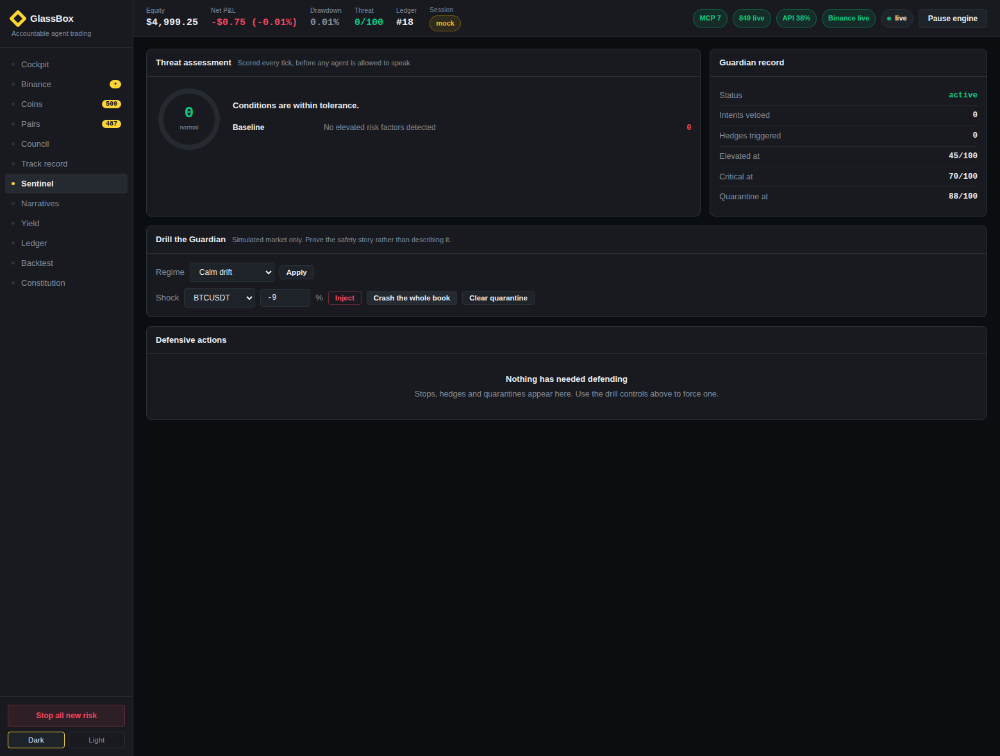
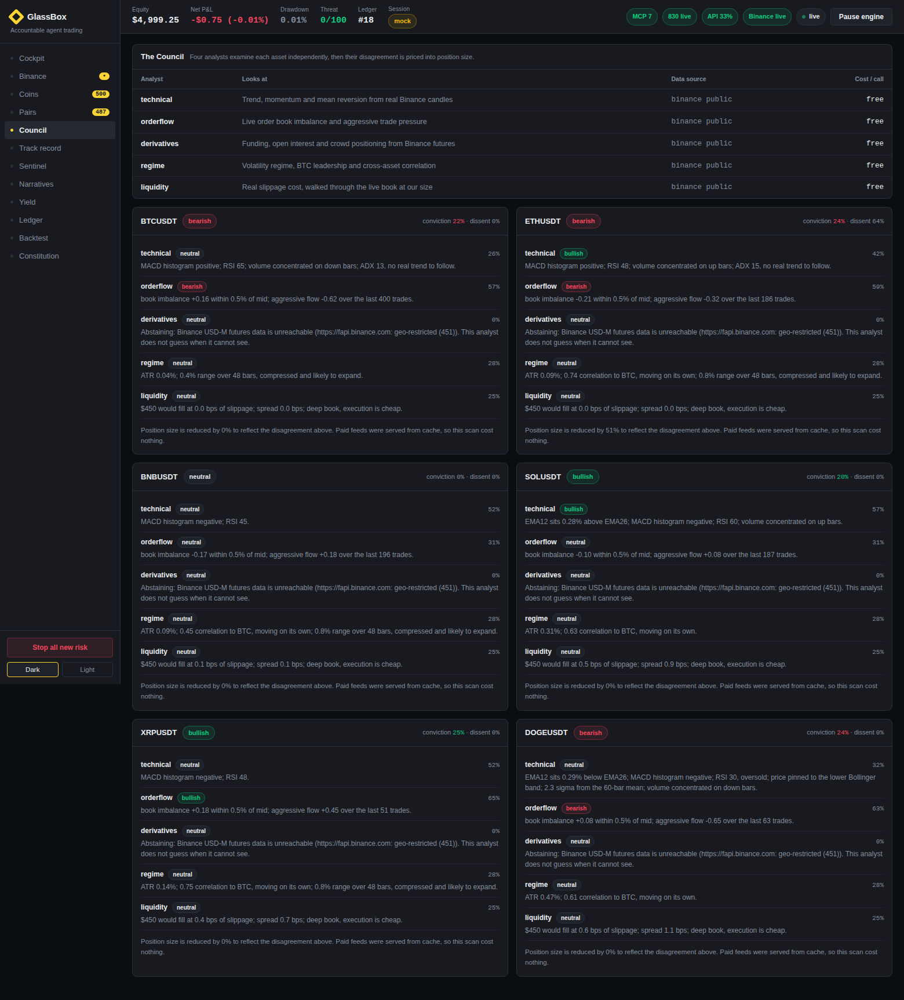

# GlassBox

**An accountable multi-agent trading copilot for Binance Agent OS.**

Binance Agent OS gives an AI agent market data, a sub-account, trading, and
programmable payments. What it does not give anyone — including Binance — is
visibility into *why* the agent did what it did. From Binance's own launch
announcement:

> Binance can monitor resulting trading activity, including orders, but not the
> agent's broader workflow or reasoning, which runs within the user's selected
> AI application.

That sentence is the product brief. An exchange can see the order. It cannot see
the argument. And when a user is asked to approve a trade an LLM proposes, they
are being asked to sign something they cannot read.

GlassBox closes that gap. Four specialist analysts argue about every asset, a
machine-checkable rulebook you wrote adjudicates the result, a Guardian with veto
power gets the last look, and every decision — taken *or refused* — is written to
a signed, hash-chained ledger you can verify from genesis at any time.

---

## The one-sentence version

> GlassBox is a trading agent that can veto itself, and proves what it was
> thinking when it did.

---

## What it does

Four modules compete for the same pool of capital, and one Guardian can overrule
all of them.

| Module | Role |
|---|---|
| **Council** | Five analysts — technical, order flow, derivatives, regime and liquidity — examine each asset independently on live Binance data. Agreement across *independent method families* is rewarded as real confluence; a verdict resting on a single family is discounted as fragile, and disagreement is priced directly into position size |
| **Sentinel** | Scores threat every tick from price velocity, volatility, correlation, drawdown and exposure; can veto, hedge, or quarantine all capital |
| **Narrative scout** | Tracks six themes and trades only ones that are still *accelerating* while price has not yet caught up |
| **Compass** | Ranks Binance Earn against DeFi venues in one risk-adjusted calculation and parks idle cash, recalling it the moment a trade needs funding |

Underneath them sit three layers that are the actual contribution:

- **The Constitution** — policy-as-code in YAML, evaluated by deterministic
  Python *after* the AI finishes reasoning. The agents cannot edit it, argue with
  it, or route around it.
- **The Decision Ledger** — append-only, SHA-256 chained, HMAC-signed. Editing or
  deleting any past record breaks verification for that record and every one
  after it.
- **The x402 meter** — autonomous data spending is budgeted, attributed to the
  analyst that requested it, and logged like a trade.
- **Calibration** — every call is graded against what the market actually did, and
  an analyst that is consistently wrong has its vote cut automatically.

### The operator desk

The operator can also trade by hand, and every manual order goes through the same
pipeline the autonomous modules do — a second opinion from the full analyst stack,
the Constitution, the Guardian veto, and a signed receipt on the ledger.

- **Spot** — Buy opens a long-only position, Sell exits it, exactly as before.
- **Futures** — a separate USDⓈ-M perpetual book sharing the same cash pool, with
  green **Open Long** and red **Open Short**, an explicit leverage choice, and a
  reduce-only **Close**. Leverage is treated as the risk it is: the *notional* — size
  times leverage — is what every Constitution rule sees, a hard leverage ceiling is a
  denial rather than a trim, opening leveraged risk in a critical-threat market is
  vetoed exactly as a spot entry would be, and cutting risk with a reduce-only close is
  never gated. Isolated margin means a liquidation can never lose more than the margin
  committed to that one position.

### The chain inspector

A read-only lookup across ten networks — Bitcoin, Ethereum, Solana, BNB Chain, Base,
Arbitrum, Polygon, Optimism, Avalanche and Base Sepolia — resolving an address balance
or a transaction from public endpoints. Bitcoin reads from Blockstream and mempool.space;
the EVM chains and Solana read from their own RPCs with fallbacks. Payment *settlement*
stays on Base Sepolia, where it is real and testable; the inspector is the part that
spans chains.

### The Analyst Desk

The Council no longer only speaks about the handful of pairs the engine trades. On the
Council tab there is a desk you can ask about *any* Binance pair — type a question or a
pair and the same five analysts examine it live, and a chat panel lets you discuss it.

The desk is deliberately not a chatbot improvising over a prompt. It runs the real
Council, the technical indicators, the Guardian's threat read, the narrative scout and
the Constitution on the pair you name, and then composes an answer in which every figure
is one it just computed from live Binance data. A stretched RSI is the real RSI; funding
that longs are paying is the real rate; a size it says the Constitution would trim is the
size the Constitution actually trims. It reads signals against each other rather than
listing them — a green day with momentum already rolling over is called out as a move
running out of buyers, not reported as two unrelated numbers — and it is honest about any
feed that was unavailable. Because the whole point of GlassBox is that its reasoning is
auditable, the desk that explains that reasoning is held to the same standard: it does not
invent.

The desk is also a conversation, not a one-shot report. Ask a broad question and it
gives a full read; ask a follow-up — "is it bullish?", "why?", "what about risk?",
"what's the funding?" — and it answers briefly about the pair already in play instead
of reprinting the whole briefing. Whole-market questions ("how's the market?") get a
book-wide read rather than being mistaken for a ticker.

By default all of this runs with no external model and no API key. If you want a fully
conversational analyst on top of the grounded engine, set one API key and it becomes the
voice — it receives the same computed facts and is constrained to them, so it still can't
invent a number, and it falls back to the grounded desk on any error. GlassBox picks the
first key it finds and both recommended options have free tiers: `GROQ_API_KEY`
(console.groq.com) or `GEMINI_API_KEY` (aistudio.google.com), with `OPENAI_API_KEY` and
`OPENROUTER_API_KEY` also supported and `GLASSBOX_LLM_MODEL` to override the model. Put the
key in a `.env` in the project root (see `.env.example`) or your shell — nothing else
changes.

### The capital lifecycle

Every dollar is in exactly one state at all times. Modules bid to move it; the
Constitution and Guardian decide whether it moves.

```
                    ┌──────────────────────────────────┐
                    │             IDLE                 │
                    │   cash + Binance Earn / DeFi     │
                    └───────┬──────────────────▲───────┘
             Council or     │                  │  exit, or
             Narrative      │                  │  Guardian unwind
             proposes entry │                  │
                    ┌───────▼──────────────────┴───────┐
                    │           DEPLOYED               │
                    │      conviction positions        │
                    └───────┬──────────────────▲───────┘
             threat         │                  │  threat recedes
             critical       │                  │
                    ┌───────▼──────────────────┴───────┐
                    │           HEDGED                 │
                    │     exposure cut, not flat       │
                    └───────┬──────────────────────────┘
             threat ≥ 88    │
                    ┌───────▼──────────────────────────┐
                    │        QUARANTINED               │
                    │  no module may touch capital     │
                    └──────────────────────────────────┘
```

### The decision pipeline

Order is the safety argument. Protection cannot be starved by analysis, and the
Guardian cannot be talked out of a veto by a confident model.

```
  market tick
      │
      ▼
  ① stops and take-profits fire            ← before any agent speaks
      │
      ▼
  ② Guardian scores threat 0–100
      │
      ├── critical? ──► build hedge intents first
      │
      ▼
  ③ Council deliberates      ④ Narrative scans
      │                           │
      └──────────┬────────────────┘
                 ▼
  ⑤ CONSTITUTION  ── deterministic rules, strictest verdict wins
                 │        ALLOW · REQUIRE_HUMAN · DENY
                 ▼
  ⑥ GUARDIAN VETO ── last look at live conditions
                 │
      ┌──────────┼───────────────┬─────────────┐
      ▼          ▼               ▼             ▼
   execute    queue for       denied       quarantined
              your approval
      │          │               │             │
      └──────────┴───────┬───────┴─────────────┘
                         ▼
  ⑦ SIGNED RECEIPT written to the hash chain
```

---

## What it looks like

**One command. Real data immediately.**

| | |
|---|---|
|  |  |
| **Seconds after `./start.sh`** — engine already running (top-right says *Pause engine*, not *Start*), real prices already moving, nothing configured | **Same launch, Pairs tab** — 487 pairs, 570 symbols streaming live, API budget healthy at 17% |

| | |
|---|---|
|  |  |
| **Control Center** — mode switching, drills, backtests and calibration, no shell required | **Drills** — 12 adversarial checks, run on a disposable engine that never touches your real ledger |
|  |  |
| **Track Record** — every analyst graded against what the market actually did | **Binance** — a live MCP session, tools discovered from the server, real orders with justification hashes |
|  |  |
| **Pairs** — search any of 487 pairs, real candlesticks at 15m/1h/4h/1d | **Events** — Binance announcements, Fed releases and news, as risk posture only |
|  |  |
| **Sentinel** — mid-crash: threat critical, capital quarantined | **Council** — every analyst, its confidence, and the arguments that *lost* |

Dark and light themes, both using Binance's own palette.

## Verified results

Everything below was produced by the code in this repo. Reproduce it with the
commands in [docs/TESTING.md](docs/TESTING.md).

### Safety drills — 12 / 12 passing

```
python -m glassbox drill
```

| Drill | Asserts |
|---|---|
| Flash crash detected as critical | Threat scoring reacts to a market-wide gap |
| Exposure cut when the crash hits | Stops or hedges actually reduce risk |
| Guardian vetoes new risk while critical | Veto overrides an otherwise-legal intent |
| Oversized position capped | Constitution trims rather than blindly accepting |
| Kill switch denies every new intent | Emergency stop works |
| Entries without a stop loss refused | No naked entries |
| Unlisted symbols refused | Agent cannot wander into a token it read about |
| x402 data budget enforced | Autonomous spend cannot run away |
| Secrets redacted before disk | A planted API key never reaches the ledger |
| Ledger tampering detected | Chain verification catches an edited record |
| News/event risk has no path to a buy signal | Structurally cannot open a position, only reduce risk |
| Withdrawal requests refused outright | The execution surface has no withdrawal capability, by construction |

Every drill runs against its own disposable engine in a temporary directory —
verified with a test that hashes a real ledger before and after a drill run
and confirms it's byte-identical. Clicking **Run drills** in the dashboard
can never corrupt your real audit trail.

### Paper trading, 500 ticks (~41 hours of 5-minute bars)

Compared against an equal-weight buy-and-hold of the same assets over the
**identical price path**.

| Scenario | GlassBox | Buy & hold | Difference | Max DD | Trades | Win rate |
|---|---:|---:|---:|---:|---:|---:|
| Cascading crash | −0.28% | −93.55% | **+93.27%** | 0.28% | 1 | — |
| Grinding bear | −4.88% | −30.52% | **+25.64%** | 4.97% | 62 | 27.4% |
| Violent chop | −4.72% | −8.99% | **+4.27%** | 5.12% | 72 | 38.9% |
| Trending bull | +17.96% | +36.47% | −18.51% | 11.14% | 28 | 75.0% |
| Calm drift | −0.45% | +0.43% | −0.88% | 1.46% | 15 | 33.3% |

**Read this honestly.** GlassBox is a risk-first system. It captures roughly half
of a bull market and avoids most of a bear. In the cascading-crash scenario the
Guardian quarantined capital and the book finished flat while buy-and-hold lost
almost everything. If you want a system that maximises upside, this is the wrong
one. These numbers are not tuned to flatter the demo, and the underperformance
rows are left in on purpose.

The simulated market is a seeded random walk, not a backtest against real
history. It exists to make the safety behaviour reproducible and demonstrable on
demand, which you cannot do on a live order book while a judge is watching.

---

## Quick start

**One command. That's the whole install.**

```bash
git clone <your-repo-url> glassbox
cd glassbox
./start.sh          # Linux / macOS
```

```powershell
git clone <your-repo-url> glassbox
cd glassbox
.\START.bat          # Windows — or just double-click START.bat in Explorer
```

That's it. The script checks for Python, creates an isolated environment the
first time it runs, installs everything GlassBox needs, starts the dashboard
with **real Binance market data already on**, and **opens your browser
automatically**. No `pip install` to type, no environment variables to set, no
"press Start engine" — the engine is already running with live prices by the
time the tab opens.

Every launch after the first skips straight to starting up — no reinstalling,
no network call for anything already present, verified end to end: a second
launch is ready in about 3 seconds with zero pip activity.

Trading itself stays in **paper mode by default** — simulated fills, nothing
reaches Binance — regardless of how immediate everything else is. Real data
flowing from the first second is safe; real orders are not something this
project ever turns on without an explicit, separate confirmation. See
[Execution: five surfaces, one code path](#execution-five-surfaces-one-code-path)
below for how to go further when you're ready.

**Windows walkthrough with screenshots:**
[QUICKSTART_WINDOWS.md](QUICKSTART_WINDOWS.md) · **Linux/macOS:**
[docs/TESTING_LINUX.md](docs/TESTING_LINUX.md)

### Do I need to worry about running a local server? Is it secure?

Short answer: it's not a website, it never leaves your machine, and yes, it
needs to exist. Longer answer, since this deserves a real one rather than a
dismissal:

**Why there has to be a backend at all.** Three things GlassBox does are
structurally impossible from a plain HTML page with no server behind it:

1. **The audit ledger needs a signing key that isn't readable from the
   browser.** Anything sitting in client-side JavaScript is readable via
   devtools by definition — there is no such thing as a secret in a browser
   tab. The ledger's HMAC key has to live somewhere a page's own script can't
   reach it.
2. **The Guardian has to keep watching even when you're not looking at the
   tab.** Threat scoring, stop-losses, and the tick loop all need to keep
   running in the background — a browser tab that's asleep, backgrounded, or
   closed cannot keep evaluating risk.
3. **Binance's own OAuth flow requires a real local listener.** The redirect
   after you log in has to land somewhere — `http://127.0.0.1:8788/callback`
   — and only a real process bound to that port can catch it. A static page
   has nothing listening.

**What "local server" actually means here, concretely:**

- It binds to `127.0.0.1` only. There is no code path to `0.0.0.0`, no flag
  that opens it to your network, and nothing on another device on your wifi
  can reach it — check yourself with `netstat` (Linux/macOS) or
  `Get-NetTCPConnection -LocalPort 8787` (Windows) and you'll see it listening
  on loopback only.
- Every action that changes anything (starting the engine, confirming a
  trade, switching modes) requires a session token generated fresh for that
  process and never written anywhere a webpage could read it from outside
  your own browser tab.
- It holds no Binance API key, ever — the only credential path is a real
  OAuth login against Binance's own servers, the same way you'd log into any
  website.

This is the same architecture as Jupyter notebook, Grafana, a local dev
server, or any tool you've run with `npm start` — a short-lived process on
your own machine, reachable only from your own machine, that happens to serve
a page in your browser. The `start.sh`/`START.bat` scripts exist specifically
so you never have to think about any of this: double-click, browser opens,
done.

### Manual setup, if you'd rather control every step

The launcher scripts do nothing you couldn't type yourself — they exist for
convenience, not because the manual path is hidden:

```bash
cd backend
python -m venv .venv && source .venv/bin/activate    # Windows: .venv\Scripts\Activate.ps1
pip install -r requirements.txt
python -m glassbox serve --no-browser
```

Add `GLASSBOX_LIVE_DATA=0` before that last command if you'd rather start with
the seeded simulator instead of real Binance data. Every CLI command —
`drill`, `backtest`, `replay`, `calibrate`, `verify`, `connect`, `discover` —
still works exactly as documented in
[docs/TESTING_LINUX.md](docs/TESTING_LINUX.md), and every one of them is also
a button in the dashboard's **Control Center** tab. Drills and scenario
backtests always build their own disposable engine in a temp directory, so
clicking them is safe even against a real running installation.

---

## Execution: five surfaces, one code path

| Mode | Market data | Orders | Reaches Binance? |
|---|---|---|---|
| `paper` *(default)* | Simulated or real | Simulated locally | **No** |
| `shadow` | Real Binance | Simulated locally | **No** |
| `mock` | Real Binance | **Real MCP client** → bundled mock server | **No** |
| `live` | Real Binance | **Real MCP client** → `agent.binance.com` | **Yes** |
| `bridge` | Real Binance | Signed instruction for you to run | Only when you run it |

`mock` is the important one. It runs the **same** `BinanceMCPClient`, the same
JSON-RPC over Streamable HTTP, the same live tool discovery and the same error
handling as `live`. The only difference is the URL. So "we wired up MCP" is not a
claim — it is something the test suite asserts, and something a judge can watch.

```bash
python -m glassbox serve --mode mock     # real MCP client, no money at risk
python -m glassbox connect               # OAuth to your real Binance account
python -m glassbox serve --mode live     # real orders in your Agentic sub-account
```

All three are also **Control Center** actions: pick a mode card, tick the
live-mode confirmation, click **Apply** — and for connecting a real account,
click **Authorize with Binance**, which opens OAuth in a new tab and polls
for completion. No `glassbox connect` needed.

### The OAuth flow is real, and was verified against Binance

Discovery, fetched live from `agent.binance.com`:

```
GET /.well-known/oauth-protected-resource
    → resource: https://agent.binance.com/mcp/agentic
      authorization_servers: [https://agent.binance.com]

GET /.well-known/oauth-authorization-server
    → authorization_endpoint: https://accounts.binance.com/agentic-oauth/authorize
      token_endpoint:         https://accounts.binance.com/oauth-agentic/token
      token_endpoint_auth_methods_supported: ["none"]    (public client)
      code_challenge_methods_supported:      ["S256"]    (PKCE mandatory)
```

An unauthenticated POST returns `401` with
`WWW-Authenticate: Bearer resource_metadata="…"` — the MCP authorization
handshake. The client follows that chain rather than hardcoding endpoints, so it
keeps working if Binance moves them.

Security properties, all tested:

- **PKCE S256 mandatory**, verifier never leaves the process
- **Loopback-only redirect** (`http://127.0.0.1:8788/callback`) — an
  authorization code must never cross a network
- **`state` checked on return** — CSRF defence
- **Tokens encrypted at rest**, `0600`, and redacted from logs, ledger and socket
- **No withdrawal scope requested**, because none exists

### Every order carries its reasoning

The ledger head is the justification hash, and it travels *with* the order
request rather than being attached afterwards:

| Status | Side | Pair | Filled | Latency | Order | Justification |
|---|---|---|---:|---:|---|---|
| filled | BUY | SOLUSDT | $599.92 | 2 ms | 5956980834 | `24c87a9bdc…` |
| filled | BUY | ETHUSDT | $656.59 | 2 ms | 7499769907 | `f8f636105d…` |

### The local book is reconciled against Binance

Every ten ticks the agent reads its Agentic sub-account over MCP and compares.
**Binance wins.** Any drift is written to the ledger and shown to the operator,
because a silent divergence between what the agent thinks it holds and what it
actually holds is how a position cap gets breached with no rule ever firing.

Verified: sub-account $4,998.16, local book $4,998.50 — the difference is fee
rounding, and it is visible rather than hidden.

## Connecting to Binance Agent OS

```powershell
claude mcp add binance-mcp-server --transport http https://agent.binance.com/mcp/agentic
```

Then `/mcp` → `binance-mcp-server` → authenticate. Full walkthrough in
[QUICKSTART_WINDOWS.md](QUICKSTART_WINDOWS.md), including funding the Agentic
sub-account and where the Binance-side emergency stop lives.

---

## Repository layout

```
glassbox/
├── constitution.yaml           your rulebook — start here
├── backend/glassbox/
│   ├── engine.py               the tick loop and capital state machine
│   ├── constitution.py         policy engine, 17 rules
│   ├── ledger.py               hash-chained signed audit ledger
│   ├── redact.py               secret scrubbing before anything hits disk
│   ├── portfolio.py            paper execution, fees, slippage, PnL
│   ├── futures.py              USDⓈ-M perpetual book — leverage, margin, liquidation
│   ├── feeds.py                real Binance client, host failover, 1362 pairs
│   ├── ratelimit.py            request-weight governor — reserves before spending
│   ├── stream.py               websockets: every symbol live at zero REST cost
│   ├── mcp.py                  Binance MCP client — OAuth 2.1, PKCE, Streamable HTTP
│   ├── mockmcp.py              local mock Binance MCP server, for testing the real path
│   ├── execution.py            intent → MCP tool call, with the receipt bound to it
│   ├── news.py                 event risk: Binance announcements, Fed, news RSS
│   ├── marketdata.py           per-tick context, concurrent, honest degradation
│   ├── indicators.py           RSI, MACD, Bollinger, ADX, ATR — unit tested
│   ├── calibration.py          grades analyst calls against realised outcomes
│   ├── anchor.py               external anchoring of the ledger head
│   ├── replay.py               backtesting on real Binance candles
│   ├── market.py               seeded scenario simulator, for drills only
│   ├── x402.py                 metered data spend with hard budget
│   ├── server.py               FastAPI + WebSocket + static hosting
│   ├── cli.py                  serve · backtest · drill · verify
│   └── agents/
│       ├── council.py          orchestrator and dissent-aware sizing
│       ├── analysts.py         technical · orderflow · derivatives · regime · liquidity
│       ├── analysts_sim.py     seeded analysts, used only by drills
│       ├── guardian.py         threat model, veto, hedge, quarantine
│       └── scouts.py           narrative detection + yield routing
├── frontend/                   dashboard: no build step, no framework
├── skills/                     a Binance Skill Hub contribution
└── docs/
    ├── ARCHITECTURE.md   NOVELTY.md   SECURITY.md
    ├── TESTING.md        DEMO_SCRIPT.md
```

---

## Documentation

- **[QUICKSTART_WINDOWS.md](QUICKSTART_WINDOWS.md)** — A-to-Z setup on Windows,
  leading with the Control Center dashboard rather than the shell
- **[docs/TESTING_LINUX.md](docs/TESTING_LINUX.md)** — the same, for Linux/macOS
- **[docs/WINDOWS_VERIFICATION.md](docs/WINDOWS_VERIFICATION.md)** — a 25-minute
  tick-box pass through every feature, with the exact number or behaviour to
  expect at each step
- **[docs/FEATURE_CHECKLIST.md](docs/FEATURE_CHECKLIST.md)** — the master
  reference: every capability, what it does, and how to verify it yourself
- **[docs/ARCHITECTURE.md](docs/ARCHITECTURE.md)** — how the pieces fit and why
- **[docs/NOVELTY.md](docs/NOVELTY.md)** — every individual novelty claim,
  rated honestly against what already exists, with what I could *not* verify
  stated plainly
- **[docs/SECURITY.md](docs/SECURITY.md)** — threat model and the limits of
  these guarantees
- **[docs/TESTING.md](docs/TESTING.md)** — reproduce every number in this
  README from the shell
- **[docs/DEMO_SCRIPT.md](docs/DEMO_SCRIPT.md)** — a timed script for the
  submission video
- **[docs/GITHUB_UPLOAD.md](docs/GITHUB_UPLOAD.md)** — pushing this to GitHub,
  step by step

---

## Event and geopolitical risk

**News moves risk posture. It never moves direction.**

An agent that reads a headline and buys can be traded against by anyone who can
publish something that looks like a headline. Spoofed accounts, fabricated press
releases and ambiguous wording are cheap; an LLM confidently parsing them into a
market view is a manipulation surface, not an edge.

So the event layer can do exactly three things, and none of them is "buy":

| Trigger | Source | Effect |
|---|---|---|
| Delisting or suspension | **Binance's own announcement feed** | Hard block on that symbol |
| Security incident naming a held asset | Crypto news RSS | Risk score to 75, size cut |
| Fed release in the last 2 hours | **federalreserve.gov RSS** | Blackout window |
| 8+ elevated headlines in 6 hours | Aggregate | Size cut to 40% |

Binance's own feed is the only source trusted to hard-block, because a delisting
is the single largest predictable move a token makes and Binance publishes it
first. Live at time of writing: 140 Binance announcements, 20 Fed releases,
55 crypto headlines, all classified and scored.

### On public figures' posts

`SocialAdapter` exists and is **off by default**. That is a decision, not an
omission. If you enable it, four constraints are not optional: verify through the
official API and never by scraping or screenshot; treat every post as risk-only;
require corroboration before acting; and log the raw post to the ledger. A post
can be faked. A position cannot be unfaked.

---

## Data: real, live, and all of Binance

Every price, candle, order book and funding rate is fetched live from Binance's
public endpoints. No authentication, no API key, no account scope, no write path.

**1,362 tradable pairs. 500 distinct coins. All of it live.**

### Prices come over a websocket, not a polling loop

One stream — `!miniTicker@arr` — carries a price update for *every* symbol on
Binance, roughly once a second, at **zero REST weight**. That single fact is what
makes a full-market live browser affordable. A second multiplexed stream carries
book-top and trade tape for the symbols the agents are actually watching.

REST is reserved for what websockets cannot provide: order book snapshots,
historical candles, and futures positioning.

Quotes older than 20 seconds are marked **stale** rather than served as if
current. A trading agent acting on a silently frozen feed is the specific failure
this guards against.

### Request weight is a budget, and it is enforced

Binance meters spot requests by **weight**, not count. `ping` costs 1, an order
book costs 5, a ticker for every symbol costs 80. The limit is 6,000 per minute;
exceed it and you get a 429, push through that and you get an IP ban.

An agent polling 487 symbols in a loop finds this out during a demo. So API
weight is treated like every other budget here:

- weight is **reserved before** a call, not discovered after it
- a soft ceiling of 60% leaves headroom for anything else sharing the IP
- `X-MBX-USED-WEIGHT-1M` is authoritative — Binance's number always beats ours
- a 429 or 418 honours `Retry-After` exactly, because retrying through a ban is
  how a two-minute throttle becomes a two-day one
- utilisation is shown live in the dashboard

In normal operation the agent runs at roughly **10–20% of its own soft ceiling**,
because prices arrive over the websocket for free.

### Coins, not just pairs

BTC trades in 14 different pairs. Ranking `BTCUSDT` alone understates it, and
ranking by raw quote volume puts IDR- and TRY-denominated pairs at the top of
every board because they are counted in a different currency.

So every quote asset is converted to USD first, and the **Coins** view aggregates
each asset across every pair it trades in. BTC shows ~$985M across 14 pairs
rather than ~$800M for `BTCUSDT` in isolation.

| What | Endpoint | Used by |
|---|---|---|
| All tradable pairs | `/api/v3/exchangeInfo` | Markets browser — 487 USDT pairs, 1,362 in total |
| Live prices, 24h stats | `/api/v3/ticker/24hr` | Everything |
| Best bid/ask | `/api/v3/ticker/bookTicker` | Real spreads |
| OHLCV candles | `/api/v3/klines` | Technical + Regime analysts, historical backtests |
| Order book depth | `/api/v3/depth` | Order-flow imbalance, real slippage |
| Aggregated trades | `/api/v3/aggTrades` | Aggressive buy/sell pressure |
| Funding rate | `/fapi/v1/premiumIndex` | Derivatives analyst |
| Open interest | `/futures/data/openInterestHist` | Derivatives analyst |
| Long/short ratio | `/futures/data/globalLongShortAccountRatio` | Crowd positioning |
| All-market prices | `wss://…/ws/!miniTicker@arr` | Live prices, every symbol, zero weight |
| Book top + trades | `wss://…/stream?streams=…@bookTicker/…@aggTrade` | Watched symbols, sub-second |
| Rolling windows | `/api/v3/ticker?windowSize=` | 1h/4h change, not only 24h |
| Average price | `/api/v3/avgPrice` | 5-minute VWAP reference |

**Host failover.** Binance geo-restricts `api.binance.com` in some jurisdictions
and returns HTTP 451. It also publishes `data-api.binance.vision`, a market-data
mirror without that restriction. The client tries hosts in order and remembers
which worked, so the same code runs from anywhere.

**Honest degradation.** USD-M futures has no public mirror. Where a feed is
unreachable, the analyst that depends on it **abstains and says why** — it never
substitutes a plausible-looking number. The dashboard shows a per-feed health
badge and every Signal carries a `data_quality` field.

---

## Limitations, and what was done about them

The first version of this README listed six honest limitations. Here is what
each one looks like now.

### 1. "The analysts are heuristics" — mostly fixed

Five analysts now run on real Binance data: Wilder's RSI, MACD, Bollinger, ADX
and volume-profile skew over genuine candles; order book imbalance measured
within 0.5% of mid; real aggressive-trade pressure from the tape; funding, open
interest and long/short positioning; cross-asset correlation and beta to BTC;
and a liquidity analyst that walks the actual book to price the slippage on the
size we intend to trade.

Still true: these are classical signals, not proprietary alpha. The contribution
remains the accountability layer.

### 2. "Feeds are simulated" — fixed

Nothing is simulated on the live path. The simulator still exists, but only for
drills — you cannot summon a flash crash on a live book while a judge watches.
It is clearly labelled `simulator` in the UI and never runs when
`GLASSBOX_LIVE_DATA=1`.

### 3. "The ledger proves integrity, not truth" — fixed

Every directional call is now recorded with the price at the time and graded
against what the market actually did. Each analyst carries a live track record:
hit rate, **Brier score**, average forward edge, and a reliability multiplier
that scales its vote on the Council.

Brier score is the one that matters, because it measures whether the stated
confidence was *honest*. An analyst saying "bullish, 90% sure" while being right
55% of the time is worse than one saying "bullish, 55% sure" with the same hit
rate — the first is lying to the position sizer.

Backfilled from 1,665 graded calls over real Binance hourly history:

| Analyst | Calls | Hit rate | Brier | Edge | Vote weight |
|---|---:|---:|---:|---:|---:|
| regime | 500 | 45.4% | 0.224 | +16.9 bp | **1.08×** |
| technical | 500 | 38.0% | 0.287 | −2.6 bp | **0.89×** |

Read that carefully: the system measured that its own technical analyst is
performing *worse than an uninformed guess* and automatically cut its influence.
That number is left in the README rather than tuned away, because a system that
can detect a weak component is worth more than one that claims not to have any.

Run `python -m glassbox calibrate` to reproduce it.

### 4. "The device key is local" — narrowed

The ledger head is now periodically anchored to an **external witness**: Binance's
own server clock and the BTC/ETH price at that instant, with an optional webhook
to any endpoint you control.

An attacker holding your disk and device key can still re-sign a chain. What they
can no longer do is backdate it silently, because a forged history must also be
consistent with prices Binance publicly recorded — checkable by anyone,
afterwards, without trusting this machine. The checkpoint chain is itself
hash-linked, so removing a checkpoint breaks the ones after it.

### 5. "The simulator is not history" — fixed

`python -m glassbox replay` backtests on **real Binance candles**, replayed bar
by bar. Analysts see only candles up to the current bar, and fills use the *next*
bar's open rather than the signal bar's close, which is the classic way a
backtest gives itself information it could not have had.

Order-flow and liquidity analysts abstain during replay because historical order
books are not available publicly — so historical results run on three of five
analysts and are correspondingly conservative. Reconstructing a fake order book
to raise the score would be the exact failure this project exists to prevent.

### 6. "Only paper mode" — fixed

There is now a real MCP client. It authenticates with OAuth 2.1 + PKCE against
Binance's actual discovery endpoints, opens a session, discovers tools from the
server, places orders, reads sub-account balances, and reconciles the local book
against the exchange. `--mode mock` runs that entire path against a bundled
stand-in so it is testable and demoable without credentials or risk.

### 7. "Bridge mode requires you" — unchanged, by design

Binance's MCP documentation specifies confirm-before-execute and no withdrawal
scope, ever. GlassBox does not pretend otherwise. What it does is make that
confirmation worth something: you are handed one pre-vetted instruction with the
hash of the reasoning that produced it.

---

## Results on real Binance history

`python -m glassbox replay`. Real candles, no look-ahead, equal-weight
buy-and-hold over the identical window.

| Window | Interval | GlassBox | Buy & hold | Difference | Max DD | Trades |
|---|---|---:|---:|---:|---:|---:|
| 2025-08-03 → 2026-09-06 | 1d | **+1.63%** | −21.34% | **+22.97%** | 5.24% | 6 |
| 2026-03-23 → 2026-09-06 | 4h | +1.74% | +16.06% | −14.31% | 7.21% | 82 |
| 2026-07-05 → 2026-09-06 | 1h | +3.26% | +31.27% | −28.01% | 4.17% | 93 |
| 2026-08-21 → 2026-09-06 | 15m | +1.52% | +9.04% | −7.52% | 4.32% | 45 |

The 13-month daily window is the one that matters, and it is the only one that
contains a real drawdown: the market fell 21% and GlassBox finished positive with
a 5.24% maximum drawdown. The three shorter windows are recent bull runs, where a
defensive system lags badly. Both facts are in the table for the same reason.

---

## Licence

MIT. See [LICENSE](LICENSE).

**Not financial advice.** Trading digital assets carries substantial risk. This
software is provided as-is. You are responsible for anything your agent does with
your money — a point Binance makes about Agent OS, and one this project is built
around rather than around.
